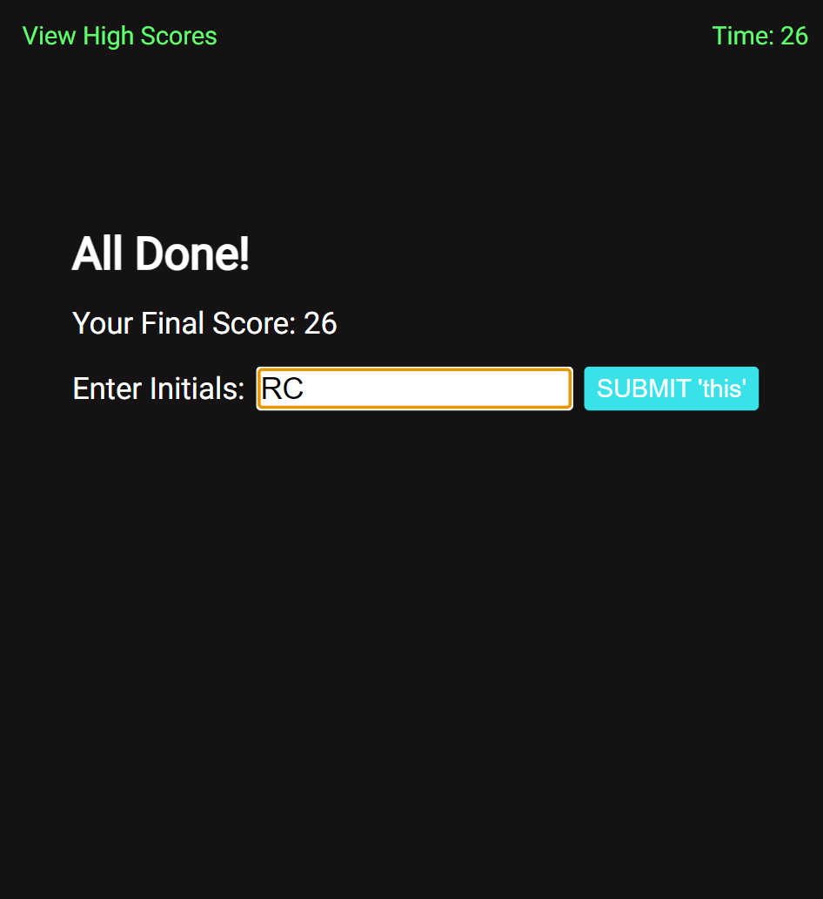

# Coding Quiz

[](https://opensource.org/licenses/MIT)


## Decription

The goal of this project was to display a quiz that allows the user to challenge there javascript knowledge. In doing so, the user will have an alloted time to complete the quiz and if wrong answers are selected the user would be penalized -10 secs off the clock/score. When the quiz has been completed and the game is over, the user is prompted to provide their initials, that correlates to there score. The user's final score is then saved if the clear button has not been clicked, and stored for further viewing to compare their progress. The user interface (UI) should work smoothly and with ease, negating all bugs encountered by the developer. The user may also click on the "View High Scores" link located at the top right of the page to directly view their previous scores. All-in-all, this project is a 'test' of resilience and adaptable learning (no matter how long it takes).

## Link to the Deployed Application

- <a href="">Click Here</a>

## User Story

```
AS A coding boot camp student
I WANT to take a timed quiz on JavaScript fundamentals that stores high scores
SO THAT I can gauge my progress compared to my peers
```

## Acceptance Criteria

```
GIVEN I am taking a code quiz
WHEN I click the start button
THEN a timer starts and I am presented with a question
WHEN I answer a question
THEN I am presented with another question
WHEN I answer a question incorrectly
THEN time is subtracted from the clock
WHEN all questions are answered or the timer reaches 0
THEN the game is over
WHEN the game is over
THEN I can save my initials and my score

```





## Credits

- Youtube, ChatGPT, docs, collegues from UNC-Chapel Hill full stack bootcamp.
- Code written by Ricky Carter.

## License

- #### This application is covered under the [MIT License](./LICENSE).
